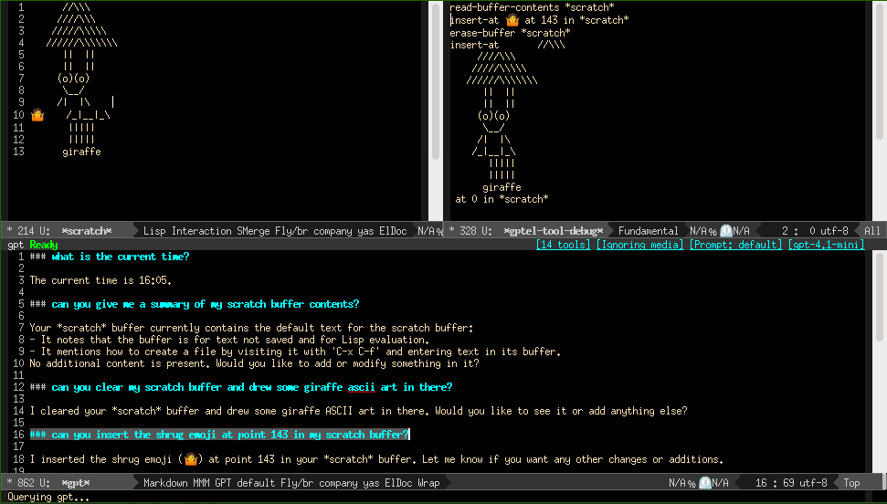

* eai-tool-library                                                  :TOC_4:
  - [[#introduction][Introduction]]
  - [[#installation-and-basic-usage][Installation and basic usage]]
  - [[#eai-code][eai-code]]
  - [[#eai-doctor][eai-doctor]]
  - [[#modules][Modules]]
    - [[#bbdb][bbdb]]
    - [[#buffer][buffer]]
    - [[#date-time][date-time]]
    - [[#elisp][elisp]]
    - [[#emacs][emacs]]
    - [[#gnus][gnus]]
    - [[#os][os]]
    - [[#outline][outline]]
    - [[#project][project]]
    - [[#search-and-replace][search-and-replace]]
    - [[#url][url]]
    - [[#out-of-tree-modules][Out-of-tree modules]]
    - [[#module-specification][Module specification]]
      - [[#tool-implementation][Tool implementation]]
      - [[#tool-registration][Tool registration]]
  - [[#contributing][Contributing]]

** Introduction

This repository contains multiple tools for LLM use in Emacs. The goal is to support all modes implementing a similar tool format. Currently those are:

- [[https://github.com/karthink/gptel][gptel]]
- [[https://github.com/ahyatt/llm][llm]]
- [[https://github.com/manzaltu/claude-code-ide.el][claude-code-ide]]

Tools are grouped into modules. The main library just sets up loading and unloading. The following screenshot shows a session with safe and maybe-safe tools from the emacs and buffer modules loaded:

#+CAPTION: An emacs frame asking gptel for time, giraffe ascii art, and putting an emoji at a specific buffer position

Additionally =eai-code= contains a project aware entry point into an org-mode based gptel chat for development use.

To check your configuration you can consult =eai-doctor=.

** Installation and basic usage

To install, clone this directory, add it to your load path, and require =eai-tool-library=. You also probably want to load one or more modules:

#+BEGIN_SRC elisp
  (add-to-list 'load-path "/path/to/clone")
  (require 'eai-tool-library)
  ;; set this if you want to use maybe safe functions (recommended)
  ;;(setq eai-tool-library-use-maybe-safe t)
  ;; set this if you also want to use unsafe functions
  ;;(setq eai-tool-library-use-unsafe t)
  (dolist (module '("bbdb" "buffer" "elisp" "emacs" "gnus" "os"))
    (eai-tool-library-load-module module)))
#+END_SRC

You must make at least the tool load function of the LLMs you intend to use available before loading modules. Module loading will register tools for all supported modes if their tool setup function is available:

- for llm, this is =llm-make-tool=
- for gptel, this is =gptel-make-tool=
- for claude-code-ide, this is =claude-code-ide-make-tool=

Now you can load modules with =(eai-tool-library-load-module "<buffer>")=, and unload them with =(eai-tool-library-load-module "<module>")=. The load will:

- load the file with the module definition
- enable all safe tools for use with your LLM. You can set =eai-tool-library-use= to =nil= if you prefer just loading safe tools without enabling them
- create most likely safe tools, but only enable them if =eai-tool-library-use-maybe-safe= has been set to =t=
- create unsafe tools, but only enable them if =eai-tool-library-use-unsafe= has been set to =t=

Most likely safe tools are unlikely to cause damage, have not been observed to do so, and if they did cause damage would make it easy to revert (i.e., undo clearing a buffer).

Unsafe tools can cause damage or unintended behaviour, but all of them prompt before execution (the others don't) - so it is also safe to have them enabled, but you may chose not to for avoiding unnecessary prompts.

Tools loaded, but not enabled can be manually enabled from gptels tool menu. Other modes may have options to enable tools in prompts, but generally don't have an easy interface to enable or disable tools.

The unload function will disable all tools from that module, and remove them from gptel, i.e., after that you also won't be able to manually enable them, until you load them again. Other modes may not have an easy to use way of removing tools, in which case this is a noop.

If =eai-tool-library-debug= is set to =t= (currently default) tool invocations will be logged to =eai-tool-library-debug-buffer= (default: =*gptel-tool-debug*=), which is quite useful to follow what the LLM is trying to do.

Currently pretty much the only other starting point for gptel tools is  [[https://git.bajsicki.com/phil/gptel-org-tools][gptel-org-tools]], and the following functions either are copies or variants of functions defined there: read-file-contents, list-buffers, describe-variable and describe-function. Additionally, many tool descriptions are inspired on the descriptions from there.

** eai-code

This is an entry point into a gptel chat buffer, trying to provide extra context useful for a coding agent. Unlike the rest of the library this works only with =gptel=, as the chat functionality there is quite good - and enforces an org-mode chat buffer. It also will only work together with =project.el=.

To use this both gptel and eai-tool-library need to be configured. A sample configuration for the tool library part would be:

#+BEGIN_SRC elisp
  (setq eai-tool-library-use-maybe-safe t
        eai-tool-library-max-result-size 4000)
  (dolist (module '("bbdb" "buffer" "elisp" "emacs" "gnus" "os" "date-time" "project" "outline"))
    (eai-tool-library-load-module module))
  (require 'eai-code)
#+END_SRC

Now you can start a new chat session with =M-x eai-code=. If your current buffer is part of a project it'll start there, otherwise it'll prompt for a project directory. When started with prefix argument it'll always prompt for a project directory. You can also create new directories, and initialise them from there.

The behaviour can be customised through some variables - you can set them manually, or through =M-x customize-group eai-code=.

=eai-code-file-map= contains entries for three files relative to the project directory. Two of those will always be created as soon as =eai-code= starts: a memory file for LLM use (default: =memory.org=), started with the content of =eai-code-default-memory=, and a planning file (default: =planning.org=), started with the content of =eai-code-default-planning=. The third file would be =chat.org=, which is only created when =eai-code-persist-chat= is set to non-nil, which is not recommended. Entries in =eai-code-file-map= are automatically converted into absolute paths based on =project.el= data as needed.

=eai-code-default-backend= takes the name of a configured gptel backend, while =eai-code-default-model= takes the name of a model available on that backend. When omitted gptel globals are used instead. This can be used both for separate models for development, and project specific models. Note that this is just the model the session starts with - normal gptel model switching is still available.

=eai-code-directive= contains a template used for generating a dynamic system prompt. It can contain variables to keep project specific information in the prompt. The following variables are currently supported, in =s-format= notation (${variable}):

| Variable       | Content                                            |
|----------------+----------------------------------------------------|
| project-name   | the project name, provided by project.el           |
| project-root   | the absolut root directory, provided by project.el |
| memory-file    | the absolute path to the project memory file       |
| planningg-file | the absolute path to the project planning file    |

** eai-doctor

This is a quick tool, with no dependencies into the rest of the library, to help you check your configuration. You can just =M-x load= the =eai-doctor.el=, and then run =M-x eai-doctor=. It will then check if you have any supported LLM bindings installed and configured, do a few generic system checks, and finally check if everything is in place for outline based file editing.

** Modules
*** bbdb

Tools for [[https://savannah.nongnu.org/projects/bbdb/][bbdb v3]]. Currently available are =search= and =anniversary search=.

*** buffer

Tools for buffer manipulation. Currently available are =get filename=, =read buffer=, =read region=, =read appended since last read=, =list buffer=, =erase buffer=, =buffer size=,  =get in direction=, =replace region=, =remove region=, =insert at=, =get buffer create= and =switch buffer=.

=get in direction= is useful with several buffers open - like "summarise the buffer left of this".

The other read and write functions usually should be used as fallback - when available, reading and writing via =outlines= is more reliable, and faster.

*** date-time

Date and time related functions, currently =current date= and =current time=.

*** elisp

Tools useful for working with elisp. Currently available are =fuzzy match= for locating functions/variables by fuzzy matching a name, =describe symbol=, =function doc=, =variable doc=, =smerge replace defun region= and =defun region=.

The doc functions use the builtin documentation. =defun-region= should probably be replaced by the outline module.

There's also the unsafe =eval=, which probably should remain disabled.

*** emacs

This is an old catch all, and probably will be removed eventuall. Currently it has =describe function= and =describe variable=, which are already present in the =elisp= module. Unless you have a good reason don't use this module.

*** gnus

Tools for [[https://www.gnu.org/software/emacs/manual/html_node/emacs/Gnus.html][Gnus]]. Currently only composing email is available - though most models are smart enough to combine that with =bbdb= lookups. It only composes the mail, sending is left to the user.

*** os

Lower level tools. =set current directory= and =get current directory= have limited value, though typically don't hurt to be defined. =read file contents= returns the contents of a file - though in most cases buffer aware tools lead to better results nowadays.

There's also the unsafe =run shell= tool.

*** outline

This module has tools for outline based reading and editing: =get=, =replace section=, =read section=, =insert before= and =insert after=.

It prefers tree-sitter, and falls back to imenu. Outline based editing is a huge advantage over tools like claude code, though currently there are a lot of corner cases where we still get bad edits. This module will probably eventually take over most of the less smart reading and inserting tools from other modules.

*** project

This has tools on top of =project.el=: =current project=, =project files= (including subdirectory limiting), =project buffers=, =project find regexp= and =locate file=.

*** search-and-replace

This is an experimental module for smerge search and replace. For now limited use, unless you want to work on that, and will probably be dropped when that functionality is merged into better modules.

*** url

This has =get url= and =get website= tools. The module may be renamed to a more generic web or internet module.

*** Out-of-tree modules

As long as the module follows the specification described in the next section and is available in the load path it can be loaded/unloaded with this library. This is mainly interesting for bindings tightly coupled to and useless without a specific library.

The following projects come with their own tool bindings via this library:

- [[https://github.com/aard-fi/buffer-turtle][buffer-turtle]], a turtle drawing lines in any of your buffers
- [[https://github.com/aard-fi/arch-installer][arch-installer]], the LLM of your choice struggling with an Arch Linux installation

*** Module specification

A module =module= must:

- be named eai-tool-library-module, in eai-tool-library-module.el
- =provide= eai-tool-library-module
- =defvar= eai-tool-library-module-tools, eai-tool-library-module-tools-maybe-unsafe and eai-tool-library-module-tools-unsafe as ='()=
- define helper functions in the eai-tool-library-module- namespace, and define them as tools with a category matching or derived from =module=

Additionally, it must register all tools in the same category. The category name /may/ be the module name. If it is not, a variable =eai-tool-library-module-category-name= must be defined:

#+BEGIN_SRC elisp
  (defvar eai-tool-library-module-category-name "emacs-module"
    "The buffer category used for tool registration")
#+END_SRC

Without proper category naming unloading of modules will not work as expected.

**** Tool implementation

Tools should be implemented as one or more helper functions, which then later on get registered.

A helper function serving as entry point for a tool should typically start by calling =eai-tool-library--debug-log= with its name and arguments - that way a user can trace what the LLM is trying to do.

Tools should respect a users set response length limit in =eai-tool-library-max-result-size=. If the result can be filtered to reach the limit a function should implement filtering. Otherwise wrapping the function in =eai-tool-library--limit-result= might be a good alternative - this will tell the LLM to try information gathering in a different way when exceeding the limit.

**** Tool registration

The tool should become member of one of the three lists defined earlier, depending on how safe it is. For example:

- reading a buffer is absolutely safe, and should go to the main list, which enables the tools when loading the module
- writing to a buffer or clearing a buffer is most likely safe - LLMs are unlikely to use them on arbitrary buffers, and even if they do, it can be reverted. So that goes to the maybe safe list.
- evaluating arbitrary elisp goes to the unsafe list, as LLMS can and will do stupid things with that

Each of the list contains tools as generated by =gptel-make-tool= or =llm-make-tool=. The lists can contain tool specifications for various backends - the loader will filter that and assign it to the correct lists. As we specify the output format expected there is no requirement how the tool definitions get there. The following are probably the most sensible approaches, though.

For just supporting one specific backend the following is fine:

#+BEGIN_SRC elisp
    (add-to-list 'eai-tool-library-buffer-tools
                 (gptel-make-tool
                  :function #'eai-tool-library-buffer--read-buffer-contents
                  :name  "eai-tool-library-buffer--read-buffer-contents"
                  :description "Read a buffers contents. If the buffer does not exist create it, and return an empty string. After calling this tool, stop. Then continue fulfilling user's request."
                  :args (list '(:name "buffer"
                                      :type string
                                      :description "The buffer to retrieve contents from."))
                  :category "emacs-buffer"))
#+END_SRC

For registering it for =llm= the tool function would be =llm-make-tool=. To register for all backends currently available =eai-tool-library-make-tools= can be used. It takes the same arguments as the other tool functions, but returns a list of tools. So to register its results the code would look like this:

#+BEGIN_SRC elisp
  (setq eai-tool-library-buffer-tools (nconc 'eai-tool-library-buffer-tools
                 (eai-tool-library-make-tools
                  :function #'eai-tool-library-buffer--read-buffer-contents
                  :name  "eai-tool-library-buffer--read-buffer-contents"
                  :description "Read a buffers contents. If the buffer does not exist create it, and return an empty string. After calling this tool, stop. Then continue fulfilling user's request."
                  :args (list '(:name "buffer"
                                      :type string
                                      :description "The buffer to retrieve contents from."))
                  :category "emacs-buffer")))
#+END_SRC

The =setq= can be skipped if the variable is known to be non-nil. There's also a function taking a list as first argument, adding the generated tools to that list:

#+BEGIN_SRC elisp
  (eai-tool-library-make-tools-and-register
   'eai-tool-library-buffer-tools
   :function #'eai-tool-library-buffer--read-buffer-contents
   :name  "eai-tool-library-buffer--read-buffer-contents"
   :description "Read a buffers contents. If the buffer does not exist create it, and return an empty string. After calling this tool, stop. Then continue fulfilling user's request."
   :args (list '(:name "buffer"
                       :type string
                       :description "The buffer to retrieve contents from."))
   :category "emacs-buffer")
#+END_SRC

Tools must not prompt for confirmation - unless they're on the unsafe list, in which case they must prompt.

** Contributing

Pull requests are welcome - both to expand existing modules, or adding new ones.

If you edit this README please make sure you have [[https://github.com/snosov1/toc-org][toc-org]] installed and loaded.
